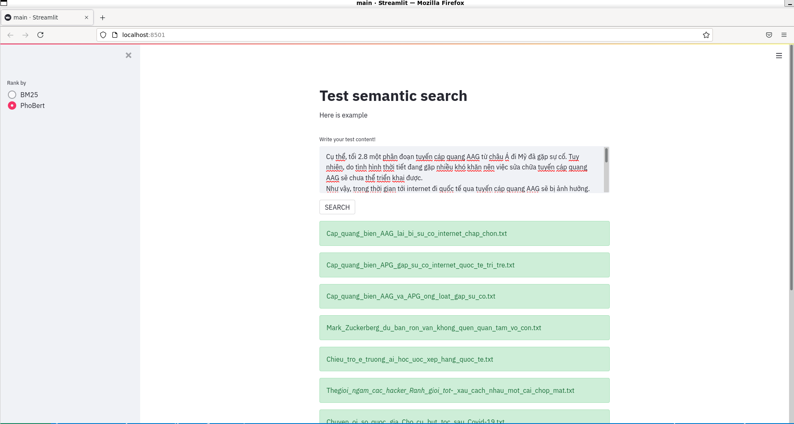

# Index documents by PhoBert Longformer model

## Introduction

This demo use PhoBertLongFormer to embedding documents to index them in elasticsearch. Than use elasticsearch cosine similarity score to find similar documents with input.

Below instructions use for Ubuntu. Some instructions maybe difference if you use other OS.


## Requirements

- RAM: >= 10G.
- [Miniconda](https://docs.conda.io/en/latest/miniconda.html).
- [Elasticsearch](https://www.elastic.co/downloads/elasticsearch).
- [Pytorch](https://pytorch.org/): Using CUDA Compute Platform if you have GPU and [cuda](https://docs.nvidia.com/cuda/cuda-installation-guide-linux/index.html).
## Install
- Clone project:
  
  ```
  git clone git@github.com:vodinhphuc/elastic_phobertlongformer_demo.git
  chmod -R +x elastic_phobertlongformer_demo
  ```
- Create virtual environment:

    ```
    cd elastic_phobertlongformer_demo
    conda env create -n demo -f environment.yml
    ```
- Run setup.sh to auto create data folder, .env file and install  [vncorenlp](https://github.com/vncorenlp/VnCoreNLP):
  
  ```
  ./setup.sh
  ```
- Edit default environment variables in [.env](.env) file.
- Save each document to each file in the [data folder](data).
  
## Run
- [Start elasticsearch](https://www.elastic.co/guide/en/elasticsearch/reference/current/starting-elasticsearch.html)
- Activate virtual environment before run scripts:
  
  ```
  conda activate demo
  ```
- Index for documents in data folder, this process takes a while.
  
  ```
  cd elastic_phobertlongformer_demo/src
  ./index.py
  ```
- Start webapp after documents has been indexed:
  
  ```
  ./main.py
  ```

## Usage:
- In main screen of web app, input you document, chose PhoBert in the sidebar's checkbox to search with PhoBert long model.
 

## Contact
Email: <phucvd2512@gmail.com> 